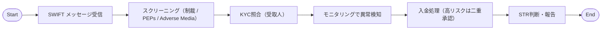

```mermaid
graph LR
  A(["Start"]) --> B["SWIFT メッセージ受信"]
  B --> C["スクリーニング（制裁 / PEPs / Adverse Media）"]
  C --> D["KYC照合（受取人）"]
  D --> E["モニタリングで異常検知"]
  E --> F["入金処理（高リスクは二重承認）"]
  F --> G["STR判断・報告"]
  G --> H(["End"])
```
